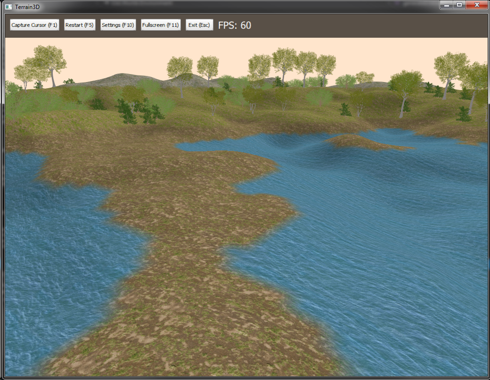
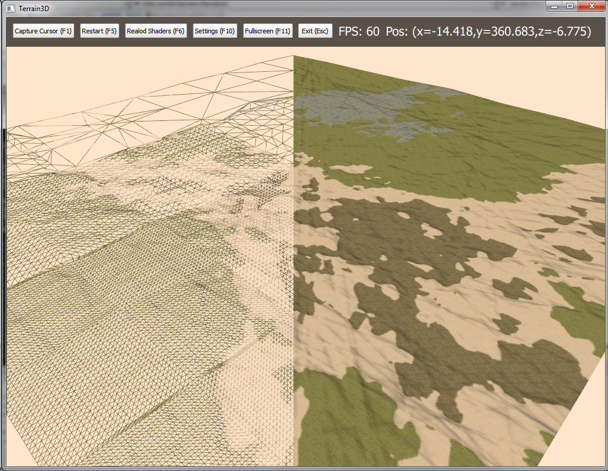
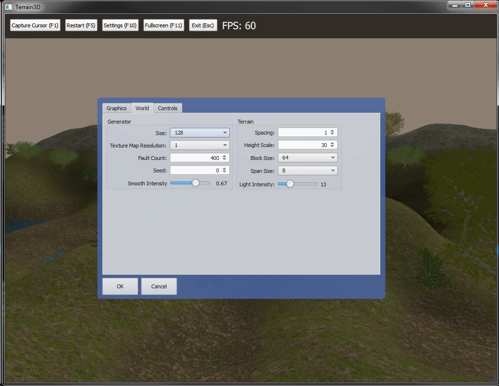

# Overview

An interactive 3D terrain simulation written in C++ using OpenGL 4 and Qt 5. The main features include:

* Procedurally generated terrain and forests.
* Continuous level of detail: Terrain chunks farther away from the camera are rendered with less detail (triangles). The LODing is done entirely on the GPU using tessellation shaders.
* Single-plane terrain texture and light mapping.
* Static mesh loading and rendering system.
* Simple animated water.
* Customizable settings menu.
* Qt Quick integration.

# Build Instructions

You will need Qt 5.3+, Visual Studio 2013+, the Qt Visual Studio plugin, and a graphics card that supports OpenGL 4.2+. Simply open the Terrain3D.sln root file in Visual Studio and everything should build right out of the box.

Terrain3D is cross platform, but only a Visual Studio project file is maintained. Someday there will be a CMake script configured so you can easily build with any toolchain.

# Screen Shots

Procedurally generated terrain and forest.

Continuous level of detail.

Customizable settings menu.

