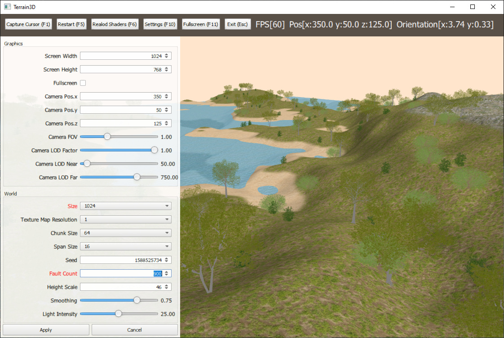
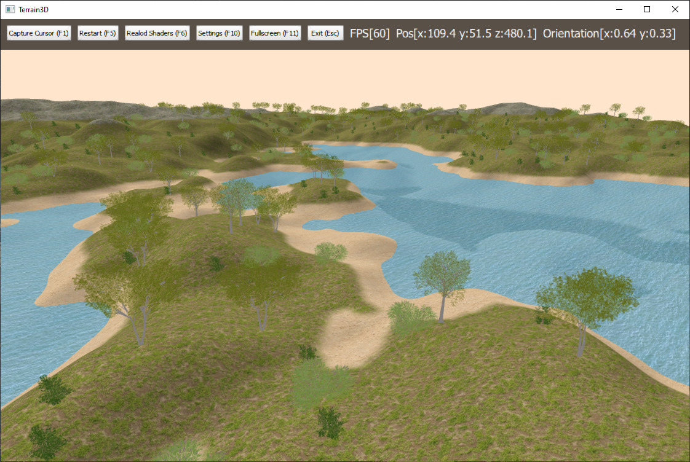
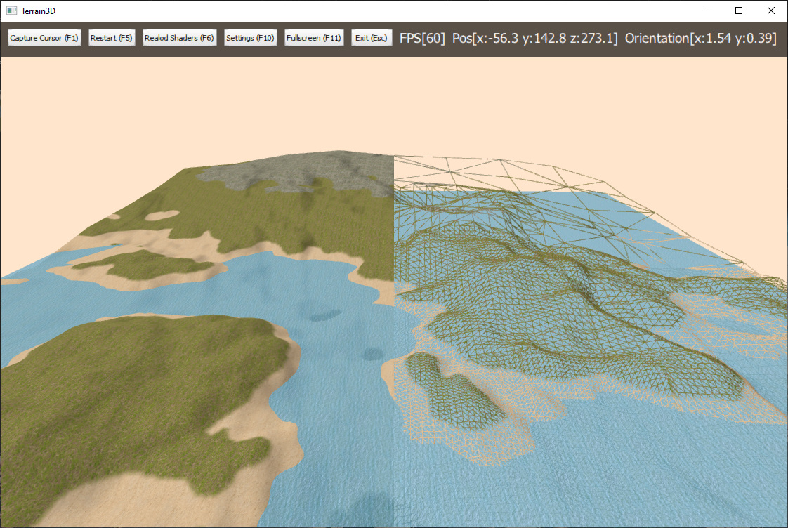

# Overview

An interactive 3D terrain simulation written in C++ using OpenGL 4 and Qt 5. The main features include:

* Procedurally generated terrain and forests.
* Continuous level of detail system to reduce geometric detail of terrain rendered farther away from the viewer.
* Single-plane terrain texture and light mapping.
* Static mesh loading and rendering.
* Simple animated water.
* Customizable settings menu.
* Qt Quick integration.

# Build Instructions

## Requirments

* **Build Machine**
  * C++ Toolchain: GCC 6.0+, MSVC 14.0+
  * Qt: 5.9+
* **Target Machine**
  * OS: Windows 7+, Ubuntu 16.04+
  * OpenGL: 4.3+

## Building

Open Terrain3D.qbs in Qt Creator and configure using a desktop kit. Set the run working directory to the Deployment directory in the repository so all resources can be loaded when running from the IDE.

# Screen Shots

